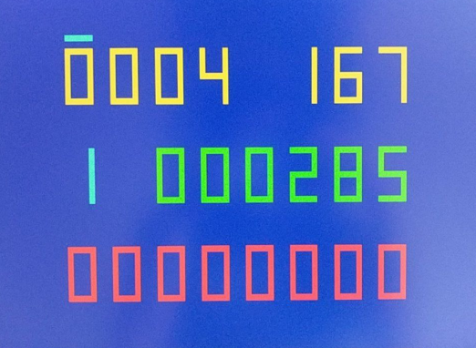

# MemTest - Utility to test SDRAM daughter board.

Ported from Neptuno port https://github.com/neptuno-fpga/MemTest_Mister

Original Memory tester for MiSTer.              https://github.com/MiSTer-devel/MemTest_MiSTer

Tested with PS2 & R2R VGA adapter (333)  https://www.waveshare.com/vga-ps2-board.htm

Tested with 32 MB SDRAM board for MiSTer (extra slim) XS_2.2 ([see connections](https://github.com/SoCFPGA-learning/DECA/tree/main/Projects/sdram_mister_deca))

Added HDMI Output.

### Result of memtest:     Working at 167 MHz without errors

## Memtest screen:

 1. Auto mode indicator (animated),
 2. Test time passed in minutes,
 3. Current memory module frequency in MHz,
 4. Memory module size:
    * 0 - no memory board detected
    * 1 - 32 MB
    * 2 - 64 MB
    * 3 - 128 MB
 5. Number of of passed test cycles (each cycle is 32 MB),
 6. Number of failed tests.

## Controls (keyboard)
* Up - increase frequency

* Down - decrease frequency

* ESC - reset the test

* A - auto mode, detecting the maximum frequency for module being tested. Test starts from maximum frequency.
  With every error frequency will be decreased.

  

Test is passed if amount of errors is 0. For quick test let it run for 10 minutes in auto mode. If you want to be sure, let it run for 1-2 hours.
Board should pass at least 130 MHz clock test. Any higher clock will assure the higher quality of the board.