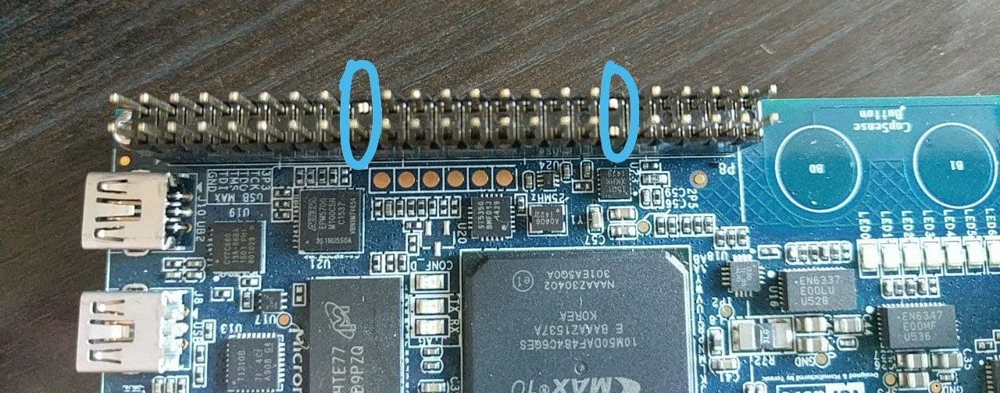
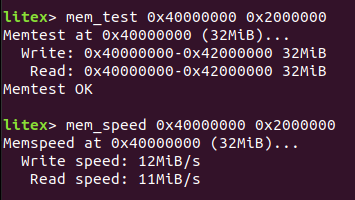

## SDRAM Mister module adapter for DECA

### Objectives and considerations

* Build an adapter to plug a 40 pin Mister SDRAM on DECA board
* Memory tested is SDRAM board for MiSTer (extra slim) XS_2.2
* Test memory is working


### Resources of information

* SDRAM XS v2.2 Altium schematics from Sorgelig
* DECA schematics
* De10-nano schematics

### Schematic

See full schematic [sdram_xs-SchDoc.pdf](sdram_xs-SchDoc.pdf) 

See Kicad folder.


### Assembly instructions 

* Buy an stackable male male header like the ones sold in this [pack](https://www.arrow.com/en/products/205-0001-02/schmartboard).

* Cut pins in the stackable header that correspond to pins 12, 29, 30 from the SDRAM module. 
* Solder external pins to the SDRAM module in pins 12, 29 & 30.
* Plug SDRAM module into the stackable header and this into the P8 DECA connector.
* Connect jumper wires at external soldered pins in 12, 29 & 30 according to schematic. It is important to connect at least one of the ground pins (I suggest pin 12) from SDRAM module to GND in P8 pins (1, 2).  Pin 29 (3V3) and pin 30 (GND) from SDRAM can be connected to P9 connector pins 3 (3V3) and 1 (GND).

### 


### Code test

I tested the code with [Litex](https://github.com/enjoy-digital/litex). 

If upstream Litex repo is not updated you can download and replace target and platform files from this [commit](https://github.com/hansfbaier/litex-boards/commit/6a85046e3381f0dc00edc71ffc7ab56b07bf6c1c) of Hans Baier. 

```sh
#Compile and load Litex for DECA board with Mister SDRAM option 
./terasic_deca.py --uart-name=gpio_serial --mister-sdram-xs-v22 --build --load
#Serial pins ("tx", "P8:3"), ("rx", "P8:4"),  (ground pin 1/2) 
#terminal output
picocom -b 115200 /dev/ttyUSB0
reboot
mem_test 0x40000000 0x2000000
mem_speed 0x40000000 0x2000000
```


