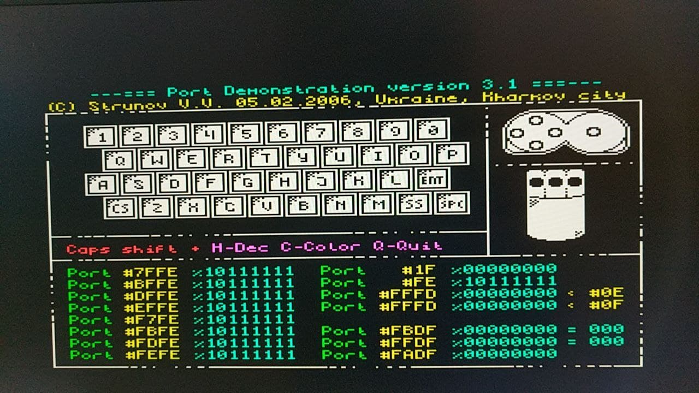

# zx48 DECA port (HDMI version)

Adapted from ua2 port (Unamiga) https://github.com/Kyp069/zx48   

Tested with 32 MB SDRAM board for MiSTer (extra slim) XS_2.2 ([see connections](https://github.com/SoCFPGA-learning/DECA/tree/main/Projects/sdram_mister_deca))

Audio works though line out 3.5 jack connector and HDMI audio output

HDMI video output.

Supports EAR for loading tap files though the line in jack audio connector.

Joystick support (UDLR + 2 buttons)

Important notes:

* **If screen is black after bootup, press space + F12 to perform a hard reset**
* **It is needed an SDcard with esxdos 0.89** (bin and sys folders)
* Key0 is assigned as HDMI DAC reset

Follows original readme.md.

<h3>zx48, a Sinclair ZX Spectrum 48K FPGA implementation</h3>

Supports this FPGA boards:

<ul>
<li>ZX-Uno (<a href="http://zxuno.speccy.org/">http://zxuno.speccy.org/</a>)</li>
<li>ZXDOS and ZXDOS+ (<a href="https://www.antoniovillena.es/store/">https://www.antoniovillena.es/store/</a>)</li>
<li>MiST (<a href="https://github.com/mist-devel/mist-board/wiki)">https://github.com/mist-devel/mist-board/wiki</a>)</li>
<li>SiDi (<a href="https://manuferhi.com/p/sidi">https://manuferhi.com/p/sidi</a>)</li>
<li>UnAmiga Reloaded (<a href="https://github.com/UnAmigaReloaded-fpga)">https://github.com/UnAmigaReloaded-fpga</a>)</li>
</ul>

Implements a standard ZX Spectrum 48K computer and the follwing hardware:

<ul>
<li>DivMMC (esxdos 0.8.9)</li>
<li>Specdrum</li>
<li>Turbosound</li>
<li>SA1099 (MiST, SiDi, UnAmiga)</li>
<li>Joystick Kempston</li>
<li>Tape loading</li>
</ul>

Keyboard shortcuts

<ul>
<li>Spectrum Reset: F12 or Ctrl+Alt+Del (ZX-Uno, ZXDOS, ZXDOS+)</li>
<li>Spectrum Reset: F6 or Ctrl+Alt+Del (MiST, SiDi, UnAmiga)</li>
<li>FPGA Reset: F11 or Ctrl+Alt+Backspace (ZX-Uno, ZXDOS, ZXDOS+)</li>
<li>NMI: F5</li>
<li>Toggle RGB/VGA: scroll lock</li>
</ul>

