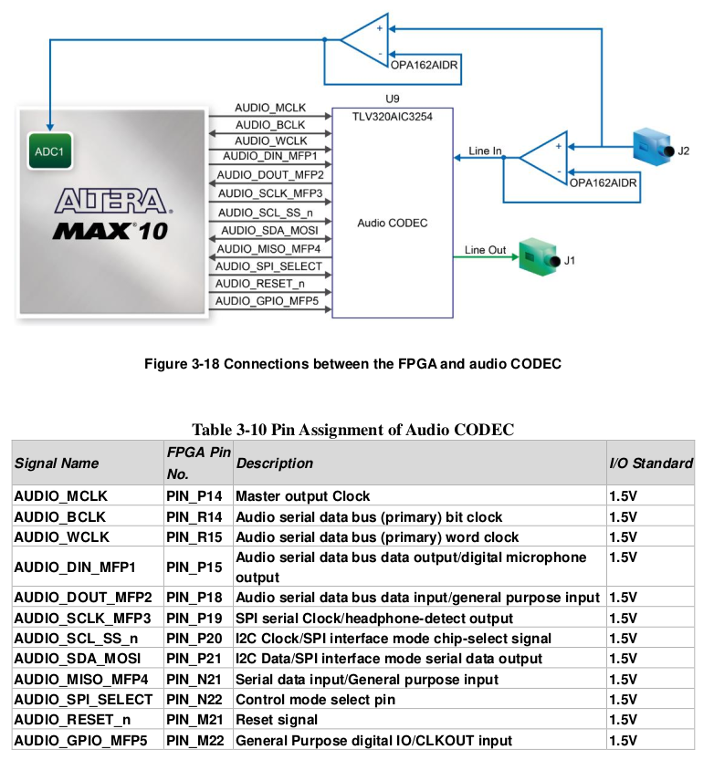

# Using DECA's integrated TLV320AIC3254 Audio DAC

The DECA offers high-quality 24-bit audio via the Texas Instruments TLV320AIC3254 audio
CODEC (Encoder/Decoder). This chip on DECA supports, line-in, and line-out ports. One of line-in
inputs is both connected to the FPGA ADC and the audio CODEC ADC, it allows user to
implement audio applications via the MAX 10 build-in ADC. The operational amplifier OPA1612 is
used to make impedance match for the two fanouts from one line-in input. The connection of the
audio circuitry to the FPGA is shown in Figure 3-18, and the associated pin assignment to the
FPGA is listed in Table 3-10. 

(from DECA's user manual)



### Resources

* [TLV320AIC3254_datasheet.pdf](datasheets/TLV320AIC3254_datasheet.pdf) 
* [slaa408a_Reference_Guide.pdf](datasheets/slaa408a_Reference_Guide.pdf) 
* [slaa404c_App_Report.pdf](datasheets/slaa404c_App_Report.pdf) 
* [HEX file format](https://www.intel.com/content/www/us/en/programmable/quartushelp/13.0/mergedProjects/reference/glossary/def_hexfile.htm)

### Register configurations

* I2S serial data routed to line out connector (LOL/R)  
  * [LOOP.hex](LOOP.hex) 
  * [LOOP.explained.txt](LOOP.explained.txt) 
* Line In routed to Line out connector.  
  * [LOOP.DECAAUDIO.hex](LOOP.DECAAUDIO.hex) 
  * [LOOP.DECAAUDIO.explained.txt](LOOP.DECAAUDIO.explained.txt) 

### Adapting cores with I2S output to work with Audio CODEC

The following implementation uses SPI communication (Max10 master, AIC3254 slave).

The original code comes from "adc_mic" example from [Terasic's Max10 plus board resource CD](https://www.terasic.com.tw/cgi-bin/page/archive.pl?Language=English&CategoryNo=218&No=1223&PartNo=4).

**Add following files to a folder named "audio" inside Quartus project folder**

* [AUDIO_SPI_CTL_RD.v](https://github.com/SoCFPGA-learning/DECA/blob/main/Projects/zx48/deca/AUDIO_SPI_CTL_RD.v) sends configuration registers and its data to the AIC3254

* [SPI_RAM.v](https://github.com/SoCFPGA-learning/DECA/blob/main/Projects/zx48/deca/SPI_RAM.v) loads configuration file "LOOP.hex" to RAM
* [LOOP.hex](LOOP.hex) contains all the register number and data associated for configuring the Audio CODEC. This one uses I2S serial data bus routed to the line out connector (LOL/R). See Register configurations for other examples.

**Modify QSF file**

* Add Verilog files:

```
set_global_assignment -name audio/VERILOG_FILE AUDIO_SPI_CTL_RD.v
set_global_assignment -name audio/VERILOG_FILE SPI_RAM.v
```

* Replace the I2S Pins from the ported core with the DECA ones:

  | DECA Pin | Audio CODEC correspondence | Template pin name |
  | -------- | -------------------------- | ----------------- |
  | PIN_P18  | AUDIO_DOUT_MFP2            | ear               |
  | PIN_P14  | AUDIO_MCLK                 | i2sMck            |
  | PIN_R15  | AUDIO_WCLK                 | i2sLr             |
  | PIN_P15  | AUDIO_DIN_MFP1             | i2sD              |
  | PIN_R14  | AUDIO_BCLK                 | i2sSck            |

* Add additional PIN assignments for AUDIO CODEC. Check audio section in this [template.](https://github.com/SoCFPGA-learning/DECA/blob/main/Projects/zx48/deca/zx48.qsf)

**Adapt Top project file**

(following excerpts are extracted from this [example](https://github.com/SoCFPGA-learning/DECA/blob/main/Projects/zx48/deca/zx48.sv))

Add missing ports to top module. You should already have the I2S (+ ear if available) ports.

```verilog
	// Audio DAC DECA
	inout wire 	AUDIO_GPIO_MFP5,
	input wire 	AUDIO_MISO_MFP4,
	inout wire 	AUDIO_RESET_n,
	output wire 	AUDIO_SCLK_MFP3,
	output wire 	AUDIO_SCL_SS_n,
	inout wire 	AUDIO_SDA_MOSI,
	output wire 	AUDIO_SPI_SELECT,
```

In the module code add & adapt this code with your own "reset" signal and "clock50" (it might work with other frequency clocks):

```verilog
//--RESET DELAY ---  
   reg RESET_DELAY_n;
   reg   [31:0]  DELAY_CNT;   

	always @(negedge reset ) begin 
	if ( reset )  begin 
			RESET_DELAY_n <= 0;
			DELAY_CNT   <= 0;
		end 
	else  begin 
			if ( DELAY_CNT < 32'hfffff  )  
				DELAY_CNT <= DELAY_CNT+1; 
			else 
				RESET_DELAY_n <= 1;
		end
	end

	// Audio DAC DECA Output assignments
    assign AUDIO_GPIO_MFP5  = 1;  // GPIO
    assign AUDIO_SPI_SELECT = 1;  // SPI mode
    assign AUDIO_RESET_n    = RESET_DELAY_n;    

    // AUDIO CODEC SPI CONFIG
    // I2S mode; fs = 48khz; MCLK = 24.567MhZ x 2
    AUDIO_SPI_CTL_RD u1 (
        .iRESET_n(RESET_DELAY_n), 
        .iCLK_50(clock50),	//50Mhz clock
        .oCS_n(AUDIO_SCL_SS_n),   //SPI interface mode chip-select signal
        .oSCLK(AUDIO_SCLK_MFP3),  //SPI serial clock
        .oDIN(AUDIO_SDA_MOSI),    //SPI Serial data output
        .iDOUT(AUDIO_MISO_MFP4)   //SPI serial data input
    );
    
```

